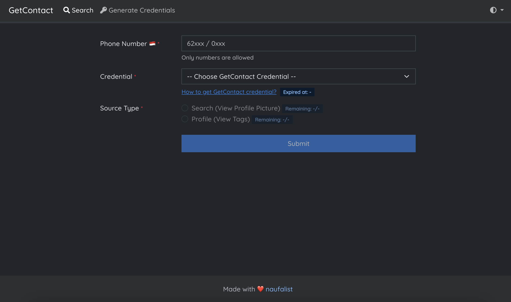
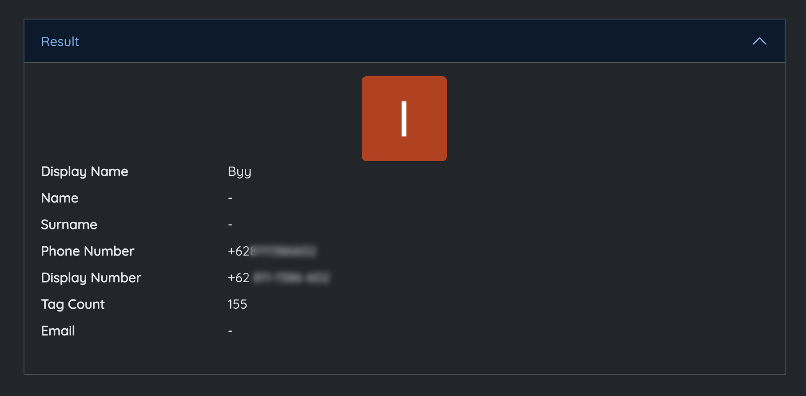
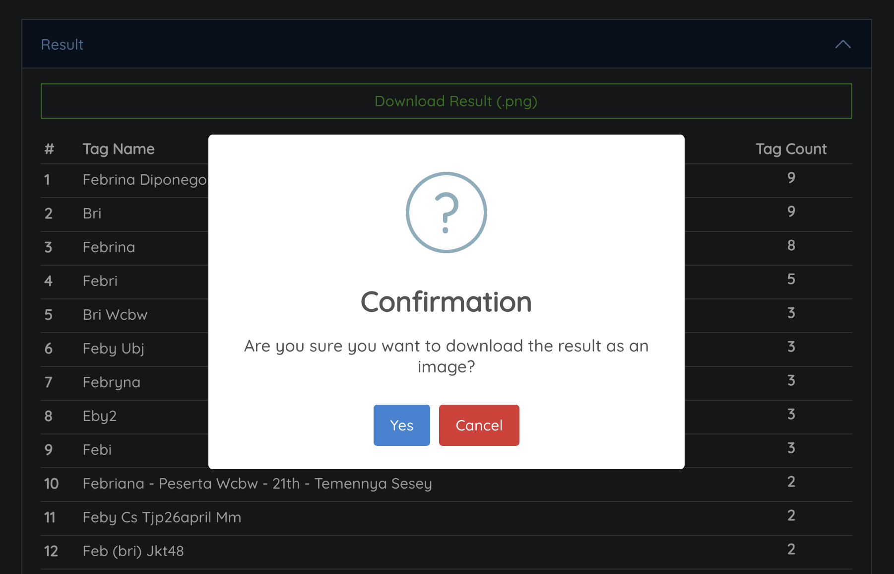
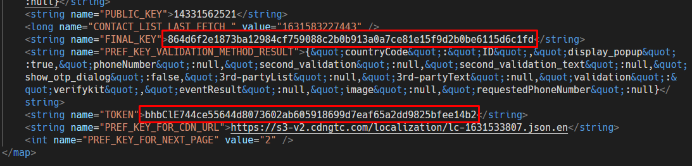

<div id="top"></div>
<!-- PROJECT LOGO -->
<br />
<div align="center">
  <a href="https://github.com/naufalist/getcontact-web">
    
  </a>

  <h3 align="center">GetContact PHP (Web)</h3>

  <p align="center">
    A simple web app to view GetContact profile or tag(s) directly via the API without needing to access the mobile app, written in PHP.
    <br />
    <!-- <a href="https://github.com/naufalist/getcontact-web"><strong>Explore the docs »</strong></a>
    <br />
    <br /> -->
    <a href="https://tools.naufalist.com/getcontact">View Demo</a>
    ·
    <a href="https://github.com/naufalist/getcontact-web/issues">Report Bug</a>
    ·
    <a href="https://github.com/naufalist/getcontact-web/issues">Request Feature</a>
  </p>
</div>


## Note
- __2025-03-31__
  This script may not work perfectly yet, and currently it can only retrieve subscription data, view profiles, and search tags. Reverse engineering is necessary to further enhance the features of the script I have made.

<p align="right">(<a href="#top">back to top</a>)</p>


<!-- ABOUT THE PROJECT -->
## About
<p align="center">
  
  
  
</p>

My friends often ask me to check the tags or profile of a phone number using GetContact because they don’t have the app. I used to do it manually — I would check the number, take a screenshot of the result, and send it to them. With this script, things are much easier. Now they can check it themselves by submitting the number through a form, and they can even download the result as an image. (***getcontact credentials (final key & token) must be stored in the config file (config.php).***).

### Built With

* [PHP](https://www.php.net/releases/8.2/en.php) `v8.2`
* [Bootswatch (cosmo)](https://bootswatch.com/cosmo/) `v5.3.2`
* [FontAwesome](https://fontawesome.com/v5/) `v5.15.4`
* [SweetAlert2](https://sweetalert2.github.io/) `v2`
* [JQuery](https://jquery.com/download/) `v3.5.1`
* [Html2Canvas](https://html2canvas.hertzen.com/) `v1.4.1`
* [Notyf](https://carlosroso.com/notyf/) `v3`

### Prerequisites

To run this app, you need PHP and/or web server in your environment. You can use [XAMPP](https://www.apachefriends.org/download.html) or [Laragon]([Laragon](https://laragon.org/download/)) for Windows, or [MAMP](https://www.mamp.info/en/downloads/) for macOS.

<p align="right">(<a href="#top">back to top</a>)</p>


### How to get GetContact Final Key & Token

To obtain the final key and token from the GetContact app, I used an Android smartphone with ROOT access enabled. You can use either a real device or an emulator (such as MEmu, LDPlayer, etc.).

> Make sure you’re already logged in to GetContact on your smartphone.
1. Open file manager, find `GetContactSettingsPref.xml` in this directory:
   ```sh
   /data/data/app.source.getcontact/shared_prefs/GetContactSettingsPref.xml
   ```
2. Find `FINAL_KEY` and `TOKEN`
   
   

3. Copy and paste both values into the configuration file: `config.php`.
   
   ```php
   // just example
   define("GTC_CREDENTIALS", json_encode([
      [
         "account" => "FILL_THIS_WITH_SHORT_DESCRIPTION_ABOUT_YOUR_GTC_ACCOUNT",
         "finalKey" => "CHANGE_WITH_YOUR_FINAL_KEY",
         "token" => "CHANGE_WITH_YOUR_TOKEN",
      ],
   ]));
   ```

Alternatively, you can use an external tool here: [https://tools.naufalist.com/getcontact/credentials/generate](https://tools.naufalist.com/getcontact/credentials/generate), to automatically generate the credentials.

<p align="right">(<a href="#top">back to top</a>)</p>


<!-- GETTING STARTED -->
## Installation

1. Clone the repository. If you’re using XAMPP/Laragon/MAMP, place it in the htdocs directory.
   ```sh
   git clone https://github.com/naufalist/getcontact-web.git
   ```
2. In **config.php**, you should update the credentials.
   
   > The number of credentials you can choose in the form depends on how many credential entries you’ve added.
   
   ```php
   // just example
   define("GTC_CREDENTIALS", json_encode([
      [
         "account" => "Account #1",
         "finalKey" => "abc",
         "token" => "def",
      ],
      [
         "account" => "Account #2",
         "finalKey" => "ghi",
         "token" => "jkl",
      ],
   ]));
   ```
3. Start the web server
4. Now, this app can be accessed in `http://localhost/getcontact-web`.

<p align="right">(<a href="#top">back to top</a>)</p>


<!-- USAGE EXAMPLES -->
## Usage

1. Access this site: `http://localhost/getcontact-web`.
2. Enter the phone number into the form, for example: `081234567890`.
3. Select the final key and token you want to use.
4. Select the type of search: whether you want to look up a profile or search for tags.
5. Click the submit button.
6. If success, information from GetContact will be displayed above the form.
7. Or, if it fails, the error message will appear in an alert and also above the form.

<p align="right">(<a href="#top">back to top</a>)</p>


<!-- CONTRIBUTING -->
## Contributing

If you have a suggestion that would make this better, please fork the repo and create a pull request. You can also simply open an issue with the tag "enhancement".

<p align="right">(<a href="#top">back to top</a>)</p>


<!-- LICENSE -->
## License

This repo is under [MIT License](https://opensource.org/licenses/mit-license.php)

<p align="right">(<a href="#top">back to top</a>)</p>


<!-- CONTACT -->
## Contact

[@naufalist](https://twitter.com/naufalist) - contact.naufalist@gmail.com

<p align="right">(<a href="#top">back to top</a>)</p>